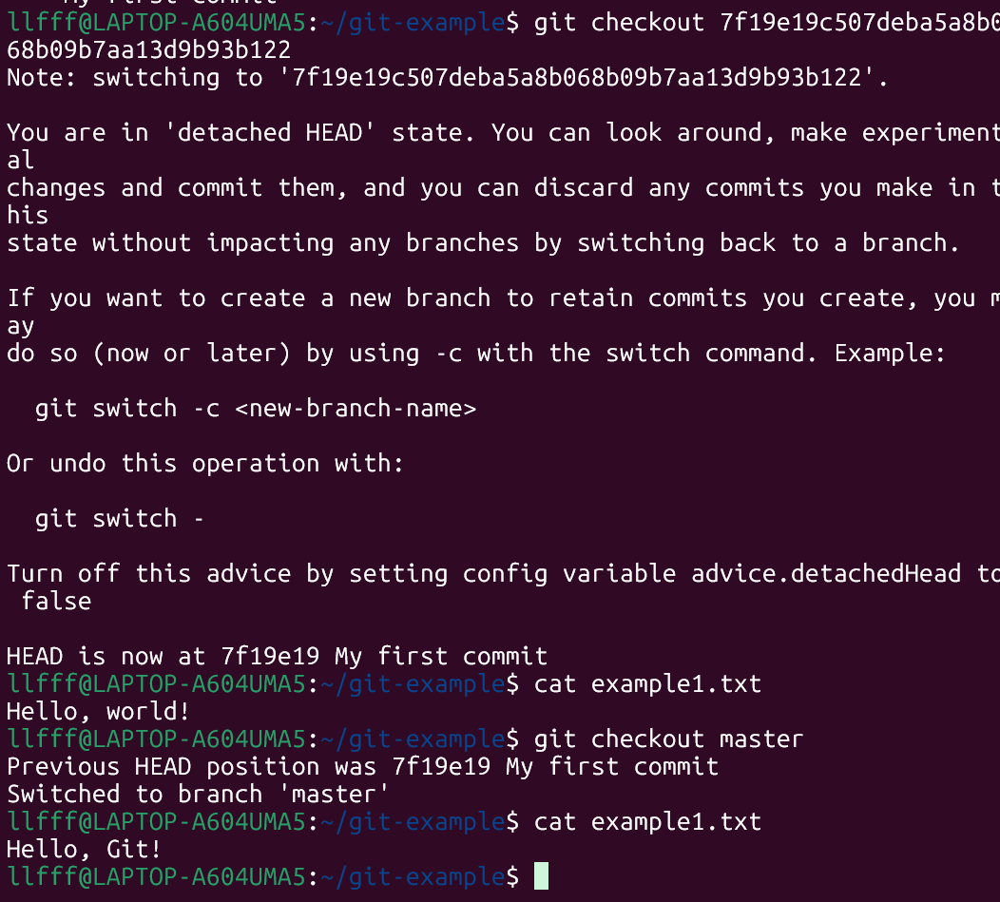
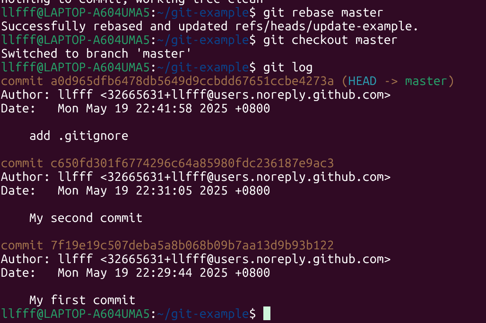

# Git 使用指南
## 一、Git 三大工作区
| 区域            | 作用           | 
|-----------------|---------------------|
| 工作区  | 直接编辑文件的地方            | 
| 暂存区  | 选择性记录修改                | 
| 版本库  | 永久存储提交历史              | 
## 二、基础工作流
### 1.初始化仓库
```bash
mkdir git-example
cd git-example
git init
```
- 
### 2.首次使用配置
```bash
git config --global user.name "Your Name"
git config --global user.email "email@example.com"
```
### 3.典型操作流程
```bash
echo Hello, world! > example1.txt  # 工作区修改
git add . # 添加到暂存区
git status #查看当前分支的状态
git commit -m "My first commit"  # 提交到版本库
```
- 
## 三、核心操作详解
### 1.查看并回退到指定历史版本
```bash
git log # 查看提交历史
git checkout <散列值> ## 临时查看历史版本
cat example1.txt
git checkout master #回到最新的提交
```
- 
- 
- 
### 2. 分支管理 ###
```bash
git branch update-example <散列值> #创建分支
git checkout update-example #切换分支
git rebase master # 变基到当前master分支
git merge update-example #合并到当前分支
```
**2.1变基分支**
```plain
A-----B-----C (master)
       \                  A-----B-----C-----D  (update_example)
        \            ===>         (master)
         D    (update-example)
```
- 
- 
### 3. 冲突解决 ###
合并的两个分支涉及同一行的修改，git 没有办法决定如何应用这些修改，因此需要手动介入解决。   
解决步骤：  
```bash
git add .
git merge --continue
```

### 4..gitignore ###
```bash
mkdir confidential
echo Password is not a good password > confidential/password.txt
echo This is pretend to be a object file > main.o
git status
echo confidential\n\*.o > .gitignore
git status
```

## 四、团队协作 ##
### 克隆仓库 ###
```bash
git clone url://path/to/be/cloned
```
### 拉取推送代码 ###
```bash
git pull
git push
```
