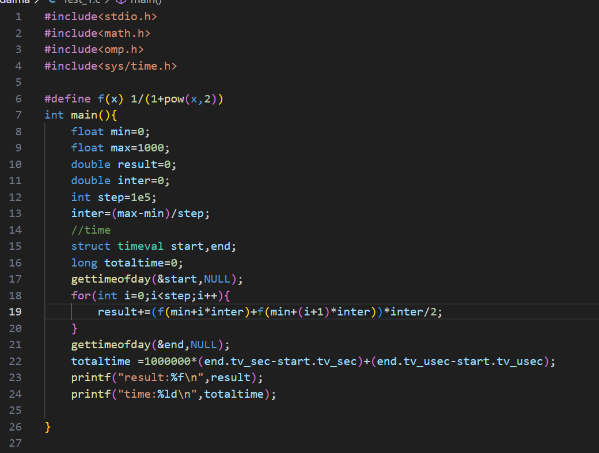
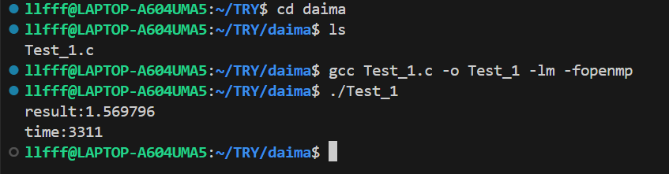
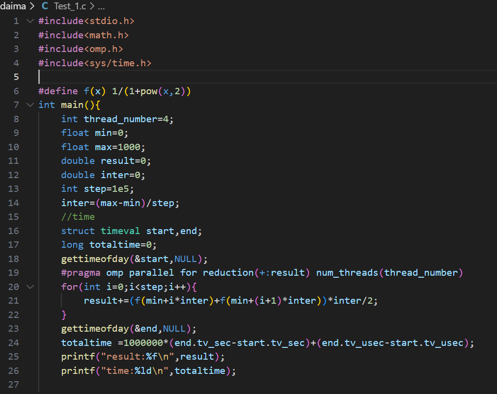
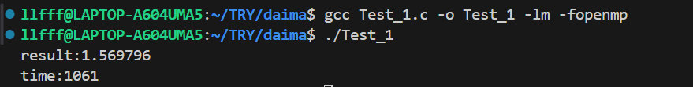
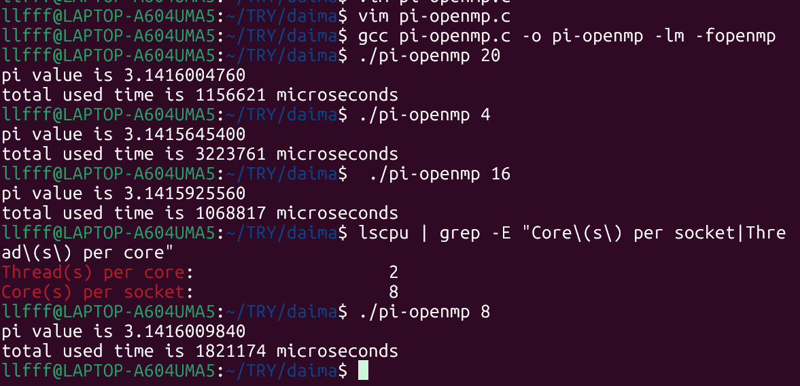
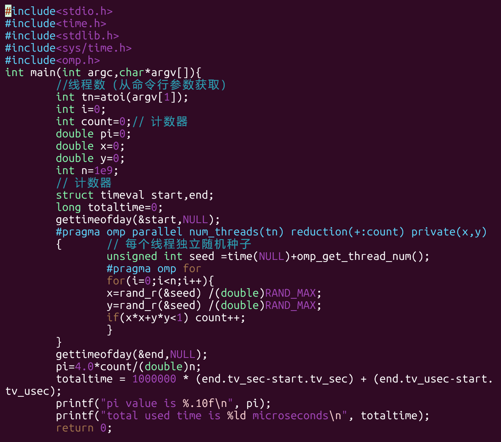

# 实例 #
## 1.并行数值积分计算程序 ##
### 1.1时间测量（Benchmarking）###
``` c
struct timeval start, end;
gettimeofday(&start, NULL);  // 记录开始时间
// ... 计算过程 ...
gettimeofday(&end, NULL);    // 记录结束时间
totaltime = 1000000*(end.tv_sec-start.tv_sec) + (end.tv_usec-start.tv_usec);
```
### 1.2注意 ###
- `#include<omp.h>`
- 编译：`gcc Test_1.c -o Test_1 -lm -fopenmp`
    - -lm（链接数学库）,-fopenmp(启用openmp)
- **速度评估:**
    - 1.理论最佳线程数:lscpu | grep "Core(s) per socket"(4,8)
    - 2.加速比公式:T1/Tp.如何计算？
    步骤 1：先获取单线程耗时T1。`./pi-openmp 1`
    步骤 2：计算加速比(4 线程加速比,16 线程加速比：)
    - 理想 vs 实际加速比    

| 线程数（p） | 理想加速比 | 你的实际加速比 | 效率（实际/理想） |   
|------------|------------|-----------------|------------------|  
| 4          | 4x         | 3.72x           | 93%              |  
| 16         | 16x        | 11.23x          | 70%              |  

- `为什么实际加速比低于理想值？`
    - `并行开销,资源争抢,负载不均衡,算法限制`

### 1.3代码 ###  
**无OpenMp**  
- 
-   
**有OpenMp**
- 
- 

## 2.蒙特卡洛方法pi值 ##
- vim pi-openmp.c  创建文件 pi-openmp.c
- **运行程序**
    - 直接运行：./pi-openmp 20  # 使用 20 个线程
    - 通过脚本
    ```c
    #!/bin/bash
    # 用法：./run.sh <线程数>
    THREADS=$1
    ./pi-openmp $THREADS
    ```
- 代码图片  
  
  
    

