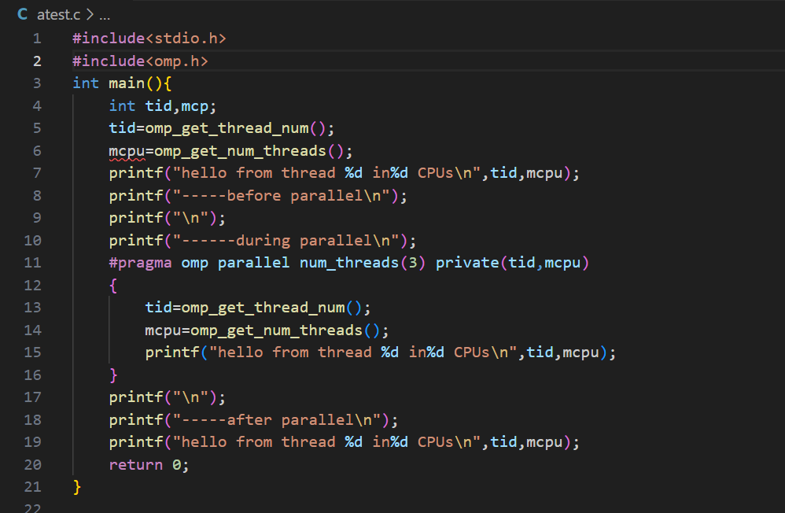
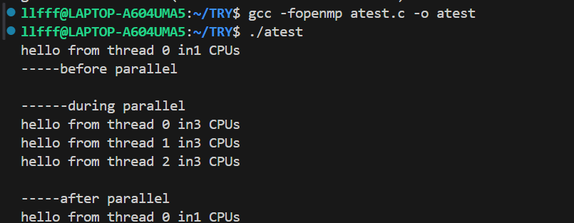

# OpenMP并行编程技术-基本介绍 #
## 1.常用概念 ##
- **并行**：并行性是指两个或多个事件在同一时刻发生，在多个程序环境下，并行性使得多个程序同一时刻可在不同CPU上同时执行。
- **并行计算**：指同时使用多种计算资源解决计算问题的过程，是提高计算机系统计算速度和处理能力的有效手段。
- **进程**
    - **广义概念**：进程是具有一定独立功能的程序关于某个数据集合上的一次运行活动，是系统进行资源分配和调度的一个独立单位。
    - **狭义概念**：进程是正在运行的程序的实例。（容易理解！）
- **线程**  
    1.线程是操作系统能够进行运算调度的最小单位。它被包含在进程之中，是进程中的实际运作单位。  
    2.一个进程中可以并发多个线程，每条线程并行执行不同的任务。  
    3.同一进程中的多条线程将共享该进程中的全部系统资源，但同一进程中的多个线程有各自的调用栈、自己的寄存器环境、自己的线程本地存储。  
- **超线程**
    - 注意：虽然采用超线程技术能够同时执行两个线程，当两个线程同时需要某个资源时，其中一个线程必须让出资源暂时挂起，直到这些资源空闲以后才能继续。  
    - **因此，超线程的性能并不等于两个CPU的性能**
## 2.openmp多核编程 ##
### 2.1预备知识 ###
**OpenMP 概念**
```
- 面向共享内存的多CPU多线程并行编程接口。
- 支持的编程语言包括 C、C++、Fortran 语言，良好的可移植性和可缩放性
```
**部分组成**
- **指导语句、库函数和环境变量**
- 指导思想是将工作划分为多个子任务分配给多个线程，从而实现多核并行处理单一的地址空间。
```
编译指导语句是串行代码实现并行化的桥梁，是编写 OpenMP 应用程序的关键。
```
**MPI 与 OpenMP**
- MPI 主要针对粗粒度级别的并行
- OpenMP 主要针对细粒度的循环并行进行并行，即在循环中将每次循环分配给不同的线程去执行
### 2.2编译指导语句格式 ###
- `#pragma omp <directive> [clause[[,] clause]... ]`
- `directive` 部分是编译指导语句的主要指令，用来指导多个 CPU 共享任务或指导多个 CPU 同步。
- `clause` 部分是可选的子句，它给出了相应的指令参数，可以影响到编译指导语句的具体执行。
### 2.3子句概述`clause`  ###
| 子句       | 描述                                                         |
|------------|--------------------------------------------------------------|
| `private`  | 指定一个或多个变量在每个线程中都有它自己的私有副本             |
| `shared`   | 指定一个或多个变量为多个线程间的共享变量                       |
| `default`  | 用来指定并行域内的变量的使用方式，有 `shared`,`none`             |
| `firstprivate` | 指定一个或多个变量在每个线程都有它自己的私有副本，并继承主线程中的同名变量的值作为初值 |
| `lastprivate` | 指定线程中的一个或多个私有变量的值在并行处理结束后复制到主线程中的同名变量中 |
| `reduction` | 用来指定一个或多个变量是私有的，并且在并行处理结束后这些变量要执行指定的归约运算，并将结果返回给主线程同名变量 | 部分是可选的子句，它给出了相应的指令参数，可以影响到编译指导语句的具体执行。

### 2.4常用指令 ###
| 指令       | 描述                                                         |
|------------|--------------------------------------------------------------|
| `parallel` | 用在一个结构块之前，表示这段代码将被多个线程并行执行         |
| `for`      | 用于 for 循环语句之前，表示将循环计算任务分配到多个线程中并行执行 |
| `sections` | 用在要被并行执行的代码段之前，用于实现多个结构块语句的任务分担 |
| `critical` | 用在一段代码临界区之前，保证每次只有一个 OpenMP 线程进入     |
| `single`   | 用在并行域内，表示一段只被单个线程执行的代码                 |
| `flush`    | 保证各个 OpenMP 线程的数据影像的一致性                       |
| `barrier`  | 用于并行域内代码的线程同步，线程执行到 barrier 时等待，直到所有线程都执行到 barrier 时才继续往下执行 |
### 2.4库函数 ###
- 运行时环境函数、锁函数和时间函数。

| 函数名称                | 描述                                                         |
|-------------------------|--------------------------------------------------------------|
| `omp_in_parallel`        | 判断当前是否在并行域中                                       |
| `omp_set_num_threads`    | 设置后续并行域中的线程数量                                   |
| `omp_get_num_procs`      | 返回计算系统中处理器的个数                                   |
| `omp_get_num_threads`    | 返回当前并行域中的线程数                                     |
| `omp_get_thread_num`     | 返回当前的线程号                                             |
| `omp_get_max_threads`    | 返回当前并行域中可用的最大线程数                             |  

## 3变量作用域 ##
**子句 `shared`**
- `shared(变量列表)`
- 将变量列表中一个或多个变量声明为线程组中子线程共享的变量。
- 所有线程只拥有该变量的一个内存地址，所有线程对共享变量的访问即是对同一地址的访问。

**规约操作 `reduction`**
- `reduction(运算符:变量列表)`
- 对前后有依赖的循环进行规约操作的并行化。
- 支持的操作符有限，支持 `+ - * / += -= *= /= | & ^`
## 简单的并行程序 ##
  
  
- `注意`:
    - 所有 OpenMP 程序编译时加 `-fopenmp`
    - 函数调用要加括号（如 omp_get_thread_num`()`）
    - 包含正确的头文件 #include <omp.h>

