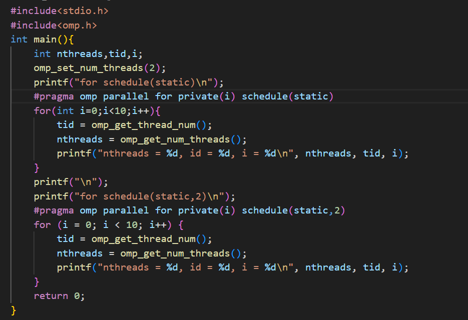
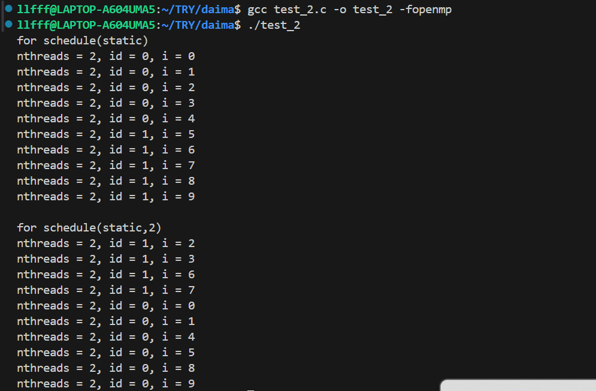
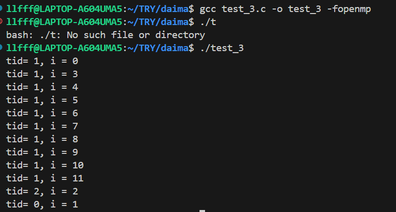

# 调度策略 #
## 调度子句 `schedule` ##
- 在 OpenMP 中，将循环分配给线程称为调度。任务调度的方式直接影响程序效率，这主要体现在以下两个方面：任务的均衡和循环体内数据访问顺序与相应的高速缓存的冲突。
- 工作量的划分与调度通过子句 `schedule` 实现，其语法格式如下：
```c
schedule(type[, size])
```
`type`:：静态调度 static，动态调度 dynamic，指导性调度 guided，运行时调度 runtime。
### 1.1静态调度 static ###
- 没有指定块的大小，迭代的划分将尽可能均匀，从而使得每个线程都能分到一块  
  

### 1.2动态调度 dynamic ###
- 当某个线程可用时，为其分配由块大小所指定的一定数量的循环迭代。
- 使用动态调度模式需要额外的开销。  
```c
#include<stdio.h>
#include<omp.h>
#define m 4*3
int main(){
    omp_set_num_threads(3);
    #pragma omp parallel for schedule(dynamic)
    for(int i=0;i<m;i++){
        printf("tid= %d, i = %d\n",omp_get_thread_num(),i);
    }
}
``` 
  
### 1.3指导性调度 guided  
- 块的大小一开始比较大，后来逐渐减小，从而减小了线程访问队列的时间。
### 1.4运行时调度 runtime  
是在运行过程中根据环境变量 OMP_SCHEDULE 来确定调度的类型
## 调度选择 ##
- 几乎相同的计算量,默认的调度方式
- 线性递增（或线性递减）,采用 static 调度
- 迭代的开销事先不能确定,schedule(runtime) 子句
# 数据安全 #
## 01 同步 ##
同步的目的是保证各个线程不会同时访问共享资源，或者保证在开始新工作前，已经完成共享资源的准备工作。OpenMP 支持以下两种线程同步机制：
- 互斥锁
  - 临界区 critical
  - 原子操作 atomic
  - 库函数
  - 锁函数
- 事件同步
  - 同步栅障
    - 显式同步栅障 barrier
    - 隐式同步栅障  
## 02 临界区和锁 ##
### 指令 atomic  
指令 atomic 要求一个特定的内存地址必须自动更新，而不让其他线程对此内存地址进行写操作。  
指令 atomic 的语法格式如下：  
```c
#pragma omp atomic
```
| 参数      | 意义   | 表达式                                                                                         |
| ------- | ---- | ------------------------------------------------------------------------------------------- |
| read    | 读数据  | v = x;                                                                                      |
| write   | 写数据  | x = expr;                                                                                   |
| update  | 更新数据 | x++; ++x; x--; --x; x binop = expr; x = x binop expr; x = expr binop x;                     |
| capture | 交换数据 | v = x++; v = ++x; v = x--; v = --x; v = x binop = expr; x = x binop expr; x = expr binop x; |  
### 指令 critical  
```c
#pragma omp critical (名称)
{
    代码块
}
```
**注意：**  
1. 同一时间内只允许有一个线程执行 critical 结构
2. 指令 critical 不允许相互嵌套
3. critical 结构内部不允许出现能够到达 critical 结构之外的跳转语句，不允许有外部的跳转语句到达 critical 结构内部。  
### 锁操作 ###
三种不同的互斥锁机制：
- 临界块操作 critical：
- 原子操作 atomic：通过单一的一条指令就能够完成数据的读取与更新操作
- 库函数的互斥锁支持：库函数的互斥锁支持的程序可以将函数放在程序所需要的任意位置。库函数还支持嵌套的锁机制。
### 同步 barrier  
同步栅障要求所有的线程同时执行到此栅障后才能继续执行下面的代码。  
``` c
//下列 OpenMP 结构结束处存在隐含的栅障 barrier:
#pragma omp parallel
#pragma omp for
#pragma omp sections
#pragma omp critical
#pragma omp single
```
## 03.critical、atomic 和锁的比较   
- atomic 指令是实现互斥访问最快的方法
- 程序中有多个不同的由 atomic 指令保护的临界区时，应使用命名的 critical 指令或者锁。
- 锁机制适用于需要互斥的是某个数据结构而不是代码块的情况。
- OpenMP 实现中，使用 critical 指令保护临界区与使用锁保护临界区在性能上没有太大的差别  
